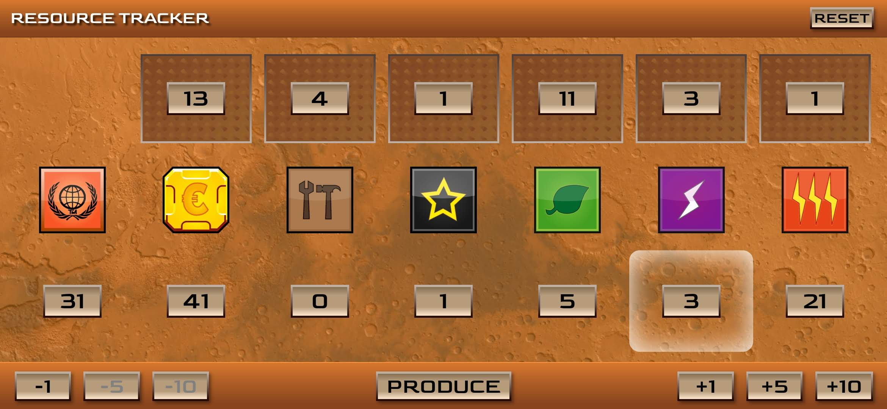

# TM-Resource-Tracker

A simple and convenient browser application for quick resource management in the popular board game called Terraforming Mars.

It uses localstorage to store the entertainment state, so you can disable the application without worrying about losing the state.

## Demo

Available at: https://wegrzynkiewicz.github.io/tm-resource-tracker/

